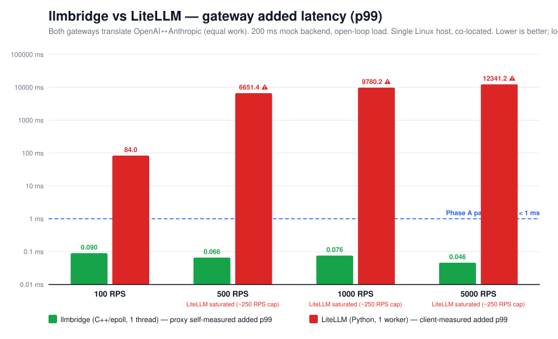
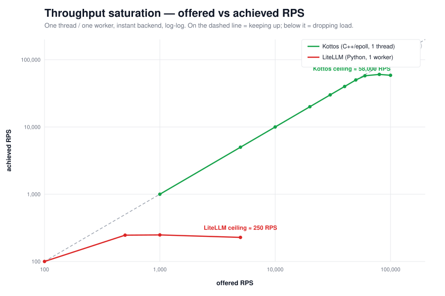

# llmbridge

> ⚡ A sub-millisecond, drop-in OpenAI-compatible **LLM gateway** in C++. Microsecond translation overhead, zero runtime dependencies, p99 < 1 ms at 1,000 RPS.

[](https://opensource.org/licenses/Apache-2.0)
[](https://en.cppreference.com/w/cpp/20)
[](https://github.com/kottosai/llmbridge/actions)

## What it does

`llmbridge` is a **sub-millisecond LLM gateway**. It sits between your app and a model provider: clients speak the **OpenAI** API to it, and it translates each request to the upstream provider's dialect (Anthropic, Gemini, Cohere, …) and the response back — adding **microseconds, not milliseconds**. Run it as a standalone binary, or embed the translation functions as a C++ library. It's the work gateways like LiteLLM, Bifrost, and Helicone do internally, rebuilt to HFT latency standards.

**Three properties that matter:**

- **Drop-in OpenAI-compatible.** Point an existing OpenAI client at `llmbridge` and route to a different provider with one flag — no app changes.
- **Microsecond overhead.** p99 well under 1 ms at 1,000 RPS on a single core (see [Benchmarks](#benchmarks)); ~58k RPS single-thread ceiling. No GC pauses, no allocation spikes — built for the workloads where the request path *is* the budget: agent loops, voice, trading agents.
- **Zero runtime dependencies.** Self-contained C++20 — both the gateway binary and the embeddable library. No Boost, no Abseil, no transitive dependency tree.

> **Open-core.** This repo is the fast gateway *core* — translate and proxy to a single upstream. Multi-provider routing, the live provider price/latency book, observability, SSO, and the managed cloud are the commercial layer from [Kottos AI](https://kottosai.com) (see the bottom of this README).

**Current provider support — non-streaming chat completions:**

- ✅ OpenAI ↔ Anthropic
- ✅ OpenAI ↔ Google Gemini
- ✅ OpenAI ↔ Cohere
- ✅ OpenAI-compatible providers (Groq, Together, Fireworks, DeepInfra, Mistral, …) — passthrough, no body translation needed
- 🚧 Streaming (SSE), tool calling, vision, `cache_control`, AWS Bedrock — planned (Phase B)

## Benchmarks

**Equal-work head-to-head:** both `llmbridge` and LiteLLM do the full OpenAI↔Anthropic translation against the same 200 ms mock backend, driven by the same open-loop, coordinated-omission-corrected load generator. Single Linux host (i7-9750H, 6c/12t), all processes co-located — so absolute tails are a dev-box upper bound. This measures **gateway overhead**, not end-to-end LLM latency.



At the unsaturated **100 RPS** apples-to-apples point, `llmbridge` adds **~0.075 ms p99** (self-measured) vs LiteLLM's **~125 ms** — and `llmbridge` holds 45–75 µs p99 across 100–5000 RPS while LiteLLM (1 uvicorn worker) saturates around **~250 RPS**.



Single-thread throughput ceiling is **~58k RPS**, with sub-millisecond p99 holding to ~50k RPS. *(Bifrost and Helicone not yet measured.)*

**Reproduce:** `./bench/run_headtohead.sh` (latency) and `./bench/saturate.sh` (throughput) — see [`bench/`](./bench). Caveats: localhost mock (no TLS/WAN yet), single worker/thread each, dev-box co-location; `llmbridge` is proxy-self-measured, LiteLLM client-measured (e2e − backend).

## Quick start

### C++ — translate a request/response body

```cpp
#include "provider/translate.hpp"

// An OpenAI-shaped chat-completion request body from your client:
std::string openai_request = R"({
    "model": "claude-3-5-sonnet-latest",
    "messages": [{"role": "user", "content": "Hello"}]
})";

// Translate it to the Anthropic Messages dialect (returns "" on parse failure):
std::string anthropic_request =
    llmbridge::provider::openai_to_anthropic_request(openai_request);

// ...send anthropic_request to Anthropic, then translate the reply back:
std::string openai_response =
    llmbridge::provider::anthropic_to_openai_response(provider_reply);
```

Also available: `openai_to_gemini_request` / `gemini_to_openai_response` and
`openai_to_cohere_request` / `cohere_to_openai_response`.

### As a gateway

Run the binary in front of an upstream and translate on the fly:

```sh
llmbridge --listen 8088 --upstream 127.0.0.1:9001 --translate anthropic
#                                                  --translate none|anthropic|gemini|cohere
```

Clients POST OpenAI-shaped requests to `:8088`; `llmbridge` translates to the upstream
dialect and back. (Plain HTTP today — TLS and real provider endpoints are Phase C; for
now front a local or already-proxied upstream.)

<!--
### Language bindings (planned)

Python (`pybind11`), Go (`cgo`), and Rust (FFI) bindings are on the roadmap and
**not yet available** — today `llmbridge` is a C++ library plus the gateway binary.
-->

## What's supported

Today — **non-streaming chat completions**, via `--translate` or the `provider::` API:

| Provider dialect | OpenAI → provider | provider → OpenAI |
|---|---|---|
| Anthropic Messages | ✅ | ✅ |
| Google Gemini (`generateContent`) | ✅ | ✅ |
| Cohere Chat v2 | ✅ | ✅ |
| OpenAI-compatible (Groq / Together / Fireworks / …) | passthrough | passthrough |

Per-dialect coverage is the common chat path: model, system prompt, user/assistant
turns, `max_tokens` / `temperature` / `top_p`; and on the response, content /
finish-reason / usage.

**Planned (Phase B):** streaming (SSE, token-by-token), tool calling (incl. streaming
deltas), `tool_result` reconciliation, vision / image inputs, `cache_control`, and
AWS Bedrock. Embeddings and audio (Whisper / TTS) are out of scope for now.

## Installation

### From source (C++)

```bash
git clone https://github.com/kottosai/llmbridge.git
cd llmbridge
cmake -B build -DCMAKE_BUILD_TYPE=Release
cmake --build build -j
sudo cmake --install build
```

Requires C++20 (GCC 13+, Clang 16+, MSVC 19.34+). Developed and tested on **Ubuntu 24.04 LTS** (kernel 6.8+) as the canonical platform. **Zero third-party runtime dependencies** — `llmbridge` is a self-contained C++20 artifact you can drop into your build without inheriting a transitive dependency tree. Build-time tools (testing, benchmarking) have their own dependencies but are not linked into the distributed library.

<!--
_Python / Go / Rust packages are planned — see [Language bindings (planned)](#language-bindings-planned) above. Today llmbridge is built from source as a C++ library + gateway binary._
-->

## Design

`llmbridge` is written in modern C++20 with these principles:

- **Lean hot path.** Zero-copy `string_view` over the input buffer; the translation builds its output in one growable buffer. A per-connection slab arena (to remove the last `new`/`delete`) is staged for the multi-loop phase.
- **Hand-rolled, dependency-free JSON.** A small recursive-descent parser into an ordered DOM plus a string-append builder — scoped to the chat-completion shapes we translate, not a general-purpose library. No `nlohmann::json`, `jsoncpp`, or `simdjson` in the shipped binary.
- **No GC pauses** (it's C++). Tail latency is bounded by `malloc`, not garbage collection.
- **No locks on the hot path.** A single-threaded `epoll` event loop with a keep-alive upstream connection pool — no shared mutable state. One core sustains ~58k RPS; scale out with `SO_REUSEPORT`. (Token-by-token SSE streaming is on the Phase B roadmap.)

The implementation is small and commented — see the `net/`, `provider/`, and `gateway/` modules.

## Project status

**Alpha.** API is unstable; expect breaking changes before v1.0. Built and maintained by [Kottos AI](https://kottosai.com), which uses it as the foundation for a hosted inference gateway.

We follow semantic versioning. Pre-1.0 versions may break the API across minor versions. The 1.0 commitment will come after at least six months of public use and at least one production deployment with stable feedback.

## License

Apache License 2.0. See [LICENSE](./LICENSE).

Copyright © 2026 Kottos AI, Inc.

## Contributions

**This project is maintained by Kottos AI and does not currently accept external code contributions.** We do welcome bug reports, feature suggestions, and questions.

See [CONTRIBUTING.md](./CONTRIBUTING.md) for details on how to engage with the project.

## Security

For responsible disclosure of security vulnerabilities, see [SECURITY.md](./SECURITY.md) or email `security@kottosai.com`.

## About Kottos AI

`llmbridge` is developed and sponsored by [Kottos AI, Inc.](https://kottosai.com), which builds exchange-grade inference infrastructure for AI applications. If you need this kind of performance at scale, with managed routing across providers, observability, and enterprise features — [get in touch](mailto:hello@kottosai.com).
