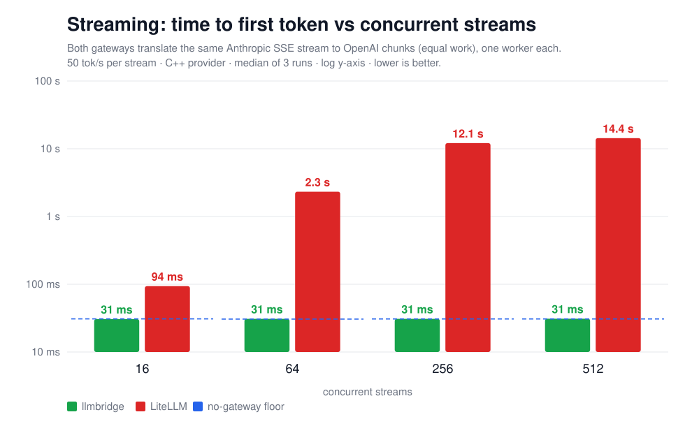
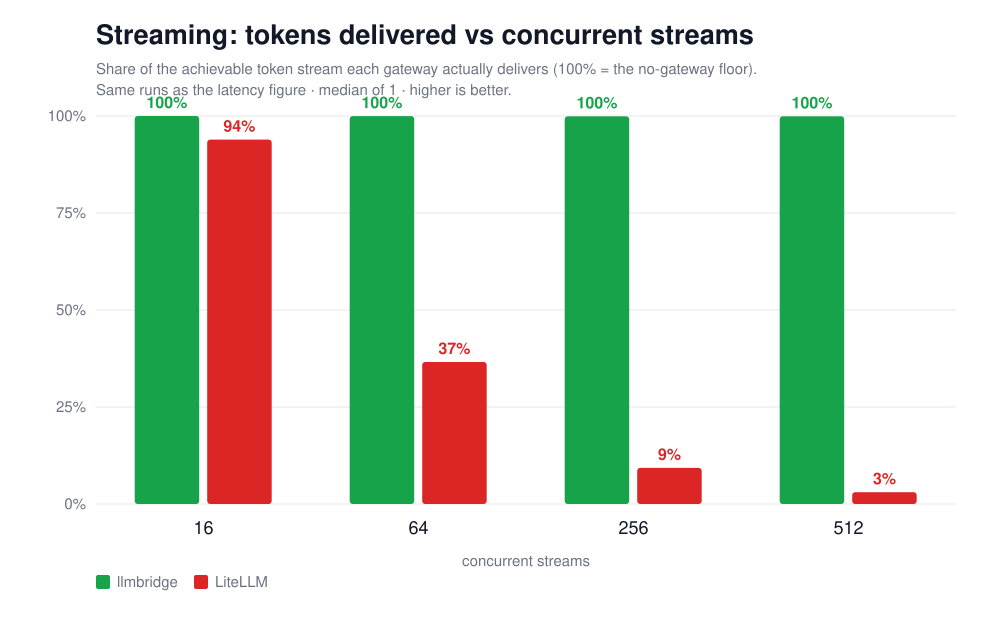

# llmbridge

> ⚡ A sub-millisecond, drop-in OpenAI-compatible **LLM gateway** in C++. Microsecond translation overhead, zero runtime dependencies, p99 < 1 ms at 1,000 RPS.

[](https://opensource.org/licenses/Apache-2.0)
[](https://en.cppreference.com/w/cpp/20)
[](https://github.com/kottos-ai/llmbridge/actions)

## What it does

`llmbridge`™ is a **sub-millisecond LLM gateway**. It sits between your app and a model provider: clients speak the **OpenAI** API to it, and it translates each request to the upstream provider's dialect (Anthropic, Gemini, Cohere, ...) and the response back, adding **microseconds, not milliseconds**. Run it as a standalone binary, or embed the translation calls directly in your own C++. It's the work gateways like LiteLLM, Bifrost, and Helicone do internally, rebuilt to High Frequency Trading (HFT) latency standards.

**Three properties that matter:**

- **Drop-in OpenAI-compatible.** Point an existing OpenAI client at `llmbridge` and route to a different provider with one flag. No app changes.
- **Microsecond overhead.** p99 well under 1 ms at 1,000 RPS on a single core (see [Benchmarks](#benchmarks)); ~84k RPS single-thread ceiling. No GC pauses. Built for the workloads where the request path *is* the budget: agent loops, voice, trading agents.
- **Zero runtime dependencies.** Self-contained C++20; both the gateway binary and the embeddable library. No Boost, no Abseil, no transitive dependency tree.

> **Open-core.** This repo is the fast gateway *core*: translate and proxy to a single upstream. Multi-provider routing, the live provider price/latency book, observability, SSO, and the managed cloud are the commercial layer from [Kottos AI™](https://kottos.ai) (see the bottom of this README).

**Current provider support for chat completions (streaming and non-streaming):**

- OpenAI ↔ Anthropic
- OpenAI ↔ Google Gemini
- OpenAI ↔ Cohere
- OpenAI-compatible providers (Groq, Together, Fireworks, DeepInfra, Mistral, ...), passthrough, no body translation needed
- Streaming (SSE, token-by-token). OpenAI ↔ Anthropic, incl. `stream_options.include_usage`
- **Tool calling**, declarations, `tool_choice`, parallel calls and `tool_result` round-trip, **streaming and non-streaming** (OpenAI ↔ Anthropic)
- **TLS to the provider** (`--upstream https://...`, opt-in build) and **credential passthrough**, enough to front `api.anthropic.com` directly
- **Per-request timing headers** (`--timing-headers`), what the gateway cost vs what the provider cost
- Not yet shipped: vision, `cache_control`, AWS Bedrock, streaming for Gemini/Cohere, Anthropic-in mode

## Benchmarks

**Equal-work head-to-head:** both `llmbridge` and LiteLLM do the full OpenAI↔Anthropic translation against the same 200 ms mock backend, driven by the same open-loop, coordinated-omission-corrected load generator. Single Linux host (i7-9750H, 6cores/12threads), all processes co-located, so absolute tails are a dev-box upper bound. This measures **gateway overhead**, not end-to-end LLM latency.


At the unsaturated **100 RPS** apples-to-apples point, `llmbridge` adds **80 µs p99** (self-measured) vs LiteLLM's **87 ms** (~**1,000×**), and `llmbridge` holds 41–80 µs p99 across 100–5,000 RPS while LiteLLM (1 uvicorn worker) saturates around **~246 RPS**.


Single-thread throughput ceiling is **~84k RPS** (best single run 87k; mean of three 84.8k).

**What sets it.** `llmbridge` runs as **one thread**, so its hard ceiling is one CPU core. At saturation that thread is **87–92% busy**, effectively out of headroom, and that is
the cap. (The *machine* meanwhile reports ~95% idle, because one busy core out of 12
logical CPUs is only ~8% of the box. It cannot use the other 11 cores because it is
single-threaded; that is what `--workers N` is for.)

Profiling that thread with `perf` splits **its own CPU time** as: **~89% executing Linux
kernel code** and **~7% executing llmbridge code**. The largest single slice of the kernel
side is the **TCP stack at 32.7%**, the unavoidable price of being a TCP proxy. In short:
*nine of every ten cycles the gateway burns are in the kernel's networking path, not in
ours.*

Two consequences. Making our own code twice as fast would raise the ceiling by **at most
~7%**, whereas `--workers 2` nearly doubles it. And the figure is **thermally dependent**, i.e.
the same build measures 87k cold and 82k once the package reaches 85 °C on this laptop.
*(An earlier revision of this README attributed the ceiling to the loopback packet path;
profiling disproved that.)* *(Bifrost and Helicone not yet measured.)*

### Streaming (SSE)

A **separate** benchmark, because it measures a different unit of work: one token, not
one request. Both gateways translate the same Anthropic event stream into OpenAI chunks
at 50 tok/s per stream, measured by the same client-side instrument (neither gateway
self-reports), against a no-gateway control run at the same concurrency. Single run per
concurrency level.





"Concurrent streams" means responses in flight at once through **one** gateway process. For instance,
512 streams is 512 simultaneous voice agents or chat responses, each receiving a token
every 20 ms.

llmbridge's time to first token stays **on the no-gateway floor (~30.8 ms)** through 512
concurrent streams while delivering **99.9–100%** of the achievable token stream, adding
**~50–120 µs per token** (against a 20 ms inter-token interval, under 1% of the budget).
A single LiteLLM worker holds at 16 streams (94% delivered), then queues: at 512 streams
it delivers **3%** of the tokens with **~13 s** to first token.

**16,384 concurrent streams on a single worker**, using **a third of one CPU core and
189 MB**: 32,756 of 32,768 offered tokens/s delivered (**99.96%**), **zero** client-side
failures, **p50 36–48 µs**, p99 under 0.6 ms, holding 32,774 sockets open. Eight
independent load generators agree within 5%.

Pushed further to **24,576 streams** it still delivers 99.93% with zero failures, at
42–47% of one core and 272 MB (p50 50–58 µs, p99 ~1.2 ms). That is **not llmbridge's
ceiling; it is the host's**: 49,152 of the 55,536 available ephemeral ports are in use,
and going higher needs the load generator spread across multiple loopback addresses. No
number above 24,576 is claimed.

**Do not mix the two sets of numbers**. "requests/sec" is not a streaming axis, and
"tokens/sec" says nothing about non-streaming throughput.

**Reproduce.** The host configuration matters as much as the commands; the full runbook
is [`bench/BENCHMARK-CONFIG.md`](./bench/BENCHMARK-CONFIG.md):

```sh
sudo sysctl -w net.ipv4.tcp_max_syn_backlog=8192 net.core.somaxconn=8192
sudo sysctl -w net.ipv4.ip_local_port_range="10000 65535"
sudo cpupower frequency-set -g performance

BACKENDS=4 ./bench/saturate.sh 5 2 90000 130000                 # throughput ceiling
./bench/run_headtohead.sh 200 15 4 100 250 500 1000 2000 5000   # non-streaming vs LiteLLM
./bench/run_stream_headtohead.sh 60 20 20 6 "16 64 256 512"     # streaming vs LiteLLM
```

`BACKENDS=4` is not optional: at the default of 1 the *mock backend* is the ceiling
(~65k), not the gateway. Full methodology and fairness controls in
[BENCHMARKS.md](./BENCHMARKS.md). Caveats: the benchmark runs against a **localhost mock over plain HTTP**. TLS and
WAN latency are deliberately excluded so the figure isolates gateway overhead (the
gateway itself *does* support TLS upstreams); single worker/thread each; dev-box
co-location; `llmbridge` is proxy-self-measured, LiteLLM client-measured (e2e − backend).

## Quick start

### C++: translate a request/response body

```cpp
#include "provider/translate.hpp"

// An OpenAI-shaped chat-completion request body from your client:
std::string openai_request = R"({
    "model": "claude-3-5-sonnet-latest",
    "messages": [{"role": "user", "content": "Hello"}]
})";

// Translate it to the Anthropic Messages dialect (returns "" on parse failure):
std::string anthropic_request =
    llmbridge::provider::openai_to_anthropic_request(openai_request);

// ...send anthropic_request to Anthropic, then translate the reply back:
std::string openai_response =
    llmbridge::provider::anthropic_to_openai_response(provider_reply);
```

Also available: `openai_to_gemini_request` / `gemini_to_openai_response` and
`openai_to_cohere_request` / `cohere_to_openai_response`.

### As a gateway

Run the binary in front of an upstream and translate on the fly:

```sh
llmbridge --listen 8088 --upstream 127.0.0.1:9001 --translate anthropic
#          --upstream also takes HOST:PORT or http(s)://HOST[:PORT][/BASE]
#                                (resolved at startup; /BASE for providers serving
#                                 an OpenAI-compatible API below the root)
#                                                  --translate none|anthropic|gemini|cohere
#          --upstream-timeout 120   # seconds of upstream silence before aborting (0 = off)
```

Clients POST OpenAI-shaped requests to `:8088`; `llmbridge` translates to the upstream
dialect and back.

**Against a real provider**, build with TLS and point it at the hosted endpoint:

```sh
cmake -B build -DLLMBRIDGE_TLS=ON        # OpenSSL ≥ 3.0; OFF by default so the
cmake --build build -j                   # default build stays dependency-free

llmbridge --upstream https://api.anthropic.com --translate anthropic --listen 8088
```

Your client keeps sending its own key as `Authorization: Bearer ...`; the gateway maps it
to the dialect the provider expects (`x-api-key` for Anthropic, `x-goog-api-key` for
Gemini) and forwards **only** that; no other client header crosses into the rebuilt
upstream request. Certificate and hostname verification are always on and cannot be
disabled.

### Logging

The gateway logs to stderr. `--log-level trace|debug|info|warn|error|off` (default
`info`), or `runtime.log_level` in a config file.

```
2026-08-13T15:05:40.315Z WARN  worker/0 gateway.cpp:2881 CAP stream buffer exceeded,
    dropping the stream ClientConnection#1(fd=6,cid=1) buffered=8389260 limit=8388608
```

Three subjects lead every message so a line can be attributed at a glance:
`ClientConnection#N`, `UpstreamConnection#N`, `Request#N`. The instance number is
process-unique and never reused, unlike the file descriptor, which the kernel recycles
as soon as a connection closes. Each line also names the worker thread.

`DEBUG` carries the per-request trace (request line, chosen upstream and whether it
came from the pool, response status), and **is compiled out by default** so the
published latency numbers are measured on exactly what ships. Build with
`-DLLMBRIDGE_LOG_LEVEL=debug` to compile it in; raising `--log-level` at runtime cannot
resurrect a line the build omitted.

`WARN` is reserved for things an operator should act on: every error with its cause,
TLS handshake failures with the OpenSSL reason, and **every configured limit when it is
hit** (pool cap, the 8 MiB streaming cap, back-pressure, buffer exhaustion, the three
timeouts), each carrying the measured value against the limit.

No credential appears at any level. Header names and lengths are logged, never values.

### Configuration file

Everything above is also settable from a JSON file, which is where this is heading:
multi-upstream routing needs an ordered list with per-upstream fields, and flat flags
cannot express that.

```sh
llmbridge --config /etc/llmbridge/llmbridge.json
```

An annotated example is in [`app/llmbridge.example.json`](app/llmbridge.example.json). Three
properties worth knowing:

- **Flags still work and override the file**, so a one-off change needs no edit.
  Precedence is not positional: a flag wins whether it appears before or after
  `--config`. Passing `--config` twice is refused instead of silently using one.
- **Unknown keys are a startup error.** A misspelled setting that is silently ignored
  is how you end up believing a value took effect when it did not, and a file has no
  command line to inspect. Wrong types and out-of-range values are refused the same
  way, each naming the key.
- **Paths, never secrets.** `cert` and `key` are filenames. Do not put provider API
  keys in it; those travel per request, from the client.

### Inbound TLS: terminating the client's connection

The same build also terminates TLS for clients, so the gateway can be a remote
endpoint instead of only a loopback sidecar:

```sh
llmbridge --listen 8443 --listen-tls --tls-cert cert.pem --tls-key key.pem \
          --upstream https://api.anthropic.com --translate anthropic
```

**One listener, one mode.** `--listen-tls` makes the single listener TLS-only; there is
no second plaintext port, so "am I exposed in the clear?" is answered by reading the
command line. The private key must not be readable beyond its owner, an expired
certificate is refused at startup, and a build without TLS **refuses** `--listen-tls`
instead of quietly serving plaintext.

> **Choose the deployment deliberately.** Two are supported and they differ in one
> thing only, who may connect:
>
> - **Loopback sidecar**, on `127.0.0.1` beside your app. Nothing to observe, so
>   plaintext inbound is fine and TLS is unnecessary. Simplest, and the default.
> - **Remote endpoint**, reachable from another machine. Requires `--listen-tls`, and
>   `llmbridge` **authenticates nobody**: anything that can reach the listener can use
>   it with its own key. Put an authenticating layer in front, or restrict who can
>   reach the port. TLS keeps the credential off the wire; it does not decide who may
>   connect.
>
> A non-loopback plaintext *upstream* prints a startup warning; there is no equivalent
> warning for a plaintext listener, because the gateway cannot tell whether it is
> reachable from outside the host. See [SECURITY.md](SECURITY.md).

<!--
### Language bindings (planned)

Python (`pybind11`), Go (`cgo`), and Rust (FFI) bindings are on the roadmap and
**not yet available**. Today `llmbridge` is a C++ library plus the gateway binary.
-->

## What's supported

Today. **chat completions**, via `--translate` or the `provider::` API:

| Provider dialect | OpenAI → provider | provider → OpenAI |
|---|---|---|
| Anthropic Messages | ✅ | ✅ |
| Google Gemini (`generateContent`) | ✅ | ✅ |
| Cohere Chat v2 | ✅ | ✅ |
| OpenAI-compatible (Groq / Together / Fireworks / ...) | passthrough | passthrough |

Per-dialect coverage is the common chat path: model, system prompt, user/assistant
turns, `max_tokens` / `temperature` / `top_p`; and on the response, content /
finish-reason / usage.

**Streaming (SSE)** is supported for OpenAI ⇄ Anthropic: send `"stream": true` and the
gateway translates the Anthropic event stream into OpenAI `chat.completion.chunk`s
token-by-token, including the final usage chunk when the request sets
`stream_options: {"include_usage": true}`. Both event-loop backends (epoll and
io_uring) implement it, with back-pressure and an upstream idle timeout.

**Tool calling** is supported **streaming and non-streaming**, OpenAI ⇄ Anthropic:
`tools` declarations (the JSON Schema is forwarded byte-for-byte, never rebuilt), all
`tool_choice` forms, parallel calls, and the `tool_result` round-trip. OpenAI's
`role: "tool"` messages become an Anthropic user turn with `tool_result` blocks, and
`tool_use` blocks come back as OpenAI `tool_calls`. Over SSE, Anthropic's
`content_block_start` / `input_json_delta` events become OpenAI `tool_calls` deltas
that a client concatenates into the call, so an agent loop works while streaming.

**TLS and credentials.** Build with `-DLLMBRIDGE_TLS=ON` (OpenSSL ≥ 3.0; off by
default so the standard build stays dependency-free) and `--upstream https://host`
connects to a real provider with certificate *and* hostname verification, which cannot
be disabled. The client's own key is mapped across the dialect boundary
(`Authorization: Bearer` → `x-api-key` / `x-goog-api-key`) and forwarded on a strict
whitelist; no other client header enters the rebuilt upstream request. Credentials are
never logged, never placed in an error body, and pooled connection buffers are scrubbed
on release. `--listen-tls` terminates the client's TLS too, so the gateway can be a
remote endpoint; it still authenticates nobody, so put something in front of it or keep
it on loopback.

**Observability.** `--timing-headers` (opt-in) adds `x-llmbridge-*` response headers
splitting a request into four disjoint spans: gateway compute, the TCP+TLS handshake
(exactly `0` on a pooled connection), the upstream `write()`, and provider time. It also
returns an orderable arrival timestamp, a monotonic sequence number, and the provider's
own token counts. Metadata only: no prompt or completion text. Every one of those numbers
is defined precisely in **[LATENCY.md](LATENCY.md)**: which stamps bound it, what is
excluded, and why the handshake is never counted as our overhead. For how the proxy works inside, on both event-loop backends, see **[GATEWAY-INTERNALS.md](GATEWAY-INTERNALS.md)**.

**Direction.** Today `llmbridge` runs in **OpenAI-in** mode: your code speaks the
OpenAI API and the gateway fronts a provider. Each request is translated in both
directions, OpenAI → provider on the way out and provider → OpenAI on the way back,
so "forward/reverse" would be ambiguous. The mode is named for the API *your code*
speaks.
**Anthropic-in** mode, an app written against the Anthropic SDK running unchanged
against an OpenAI-compatible upstream, is planned, and is the harder direction because
Anthropic's streaming protocol is richer, so the events must be synthesised instead of
discarded.

**Planned:** vision / image inputs, `cache_control`, streaming for the Gemini / Cohere
dialects, and Anthropic-in mode. AWS Bedrock and Google Vertex additionally need
request signing (SigV4, OAuth2), and Azure OpenAI needs query strings in the upstream
target, which are refused today. Embeddings and audio (Whisper / TTS) are out of scope
for now.

## Installation

### From source (C++)

```bash
git clone https://github.com/kottos-ai/llmbridge.git
cd llmbridge
cmake -B build -DCMAKE_BUILD_TYPE=Release
cmake --build build -j
sudo cmake --install build
```

Requires C++20 (GCC 13+, Clang 16+). CI builds and tests every push on **Ubuntu 24.04 LTS** (kernel 6.8+) against GCC 13, GCC 14, Clang 16, Clang 17 and Clang 18. The **translator library is portable** and is additionally built and tested on macOS; the **gateway is Linux-only by design**; it is built on epoll and io_uring, and there is no portable substitute worth the complexity. Older Linux distributions work if you supply a GCC 13+ / Clang 16+ toolchain; the distribution itself is not the constraint, the compiler is. **Zero third-party runtime dependencies**. `llmbridge` is a self-contained C++20 artifact you can drop into your build without inheriting a transitive dependency tree. Build-time tools (testing, benchmarking) have their own dependencies but are not linked into the distributed library.

> The default build is **portable**; it does *not* use `-march=native`. To reproduce
> the published benchmark numbers, tune for your CPU with `-DLLMBRIDGE_NATIVE_ARCH=ON`.

### Embed the translator as a library

`cmake --install` also installs a package config, so a downstream CMake project can:

```cmake
find_package(llmbridge CONFIG REQUIRED)
target_link_libraries(myapp PRIVATE llmbridge::provider)
```
```cpp
#include "provider/translate.hpp"
std::string anthropic = llmbridge::provider::openai_to_anthropic_request(openai_body);
```

<!--
_Python / Go / Rust packages are planned; see [Language bindings (planned)](#language-bindings-planned) above. Today llmbridge is built from source as a C++ library + gateway binary._
-->

## Design

`llmbridge` is written in modern C++20 with these principles:

- **Lean hot path.** Zero-copy `string_view` over the input buffer; the translation builds its output in one growable buffer. (It's allocation-*light*, not allocation-free: the JSON DOM allocates its node vectors and each request builds an output string; a per-connection slab arena to cut the remaining allocations is staged for the multi-loop phase.)
- **Hand-rolled, dependency-free JSON.** A small recursive-descent parser into an ordered DOM plus a string-append builder, scoped to the chat-completion shapes we translate, not a general-purpose library. No `nlohmann::json`, `jsoncpp`, or `simdjson` in the shipped binary.
- **Hardened, fuzzed parsers.** Both hand-rolled parsers are continuously **fuzzed** under ASan/UBSan (see [`fuzz/`](./fuzz)): the JSON parser is depth-limited (no stack-overflow bombs), request bodies are size-capped, and the HTTP framer is smuggling-safe. Content-Length only, with `Transfer-Encoding` and conflicting duplicate `Content-Length` rejected.
- **No GC pauses** (it's C++). Tail latency is bounded by `malloc`, not garbage collection.
- **No locks on the hot path.** A single-threaded `io_uring` event loop (multishot accept/recv + provided buffers; `epoll` fallback for older kernels) with a keep-alive upstream connection pool and no shared mutable state. One core sustains ~84k RPS (non-streaming); scale out with `SO_REUSEPORT`. Token-by-token SSE streaming runs on the same loop, with client back-pressure and an upstream idle timeout.

The implementation is small and commented; see the `net/`, `provider/`, and `gateway/` modules, and [DESIGN.md](./DESIGN.md) for the full architecture, threading/memory model, and benchmark methodology.

## Project status

**Alpha.** API is unstable; expect breaking changes before v1.0. Built and maintained by [Kottos AI](https://kottos.ai), which uses it as the foundation for a hosted inference gateway.

We follow semantic versioning. Pre-1.0 versions may break the API across minor versions. The 1.0 commitment will come after at least six months of public use and at least one production deployment with stable feedback.

## License

Apache License 2.0. See [LICENSE](./LICENSE).

Copyright © 2026 Kottos AI, Inc.

## Trademarks

"Kottos AI"™ and "llmbridge"™, and the Kottos AI logo, are trademarks of Kottos AI, Inc.
The Apache 2.0 license covers the **source code** in this repository; per its Section 6 it
does **not** grant any right to use these names or logos. See [TRADEMARKS.md](./TRADEMARKS.md)
for what's permitted.

## Contributions

**This project is maintained by Kottos AI and does not currently accept external code contributions.** We do welcome bug reports, feature suggestions, and questions.

See [CONTRIBUTING.md](./CONTRIBUTING.md) for details on how to engage with the project.

## Security

For responsible disclosure of security vulnerabilities, see [SECURITY.md](./SECURITY.md) or email `security@kottos.ai`.

## About Kottos AI

`llmbridge` is developed and sponsored by [Kottos AI, Inc.](https://kottos.ai), which builds exchange-grade inference infrastructure for AI applications. If you need this kind of performance at scale, with managed routing across providers, observability, and enterprise features. [get in touch](mailto:hello@kottos.ai).
